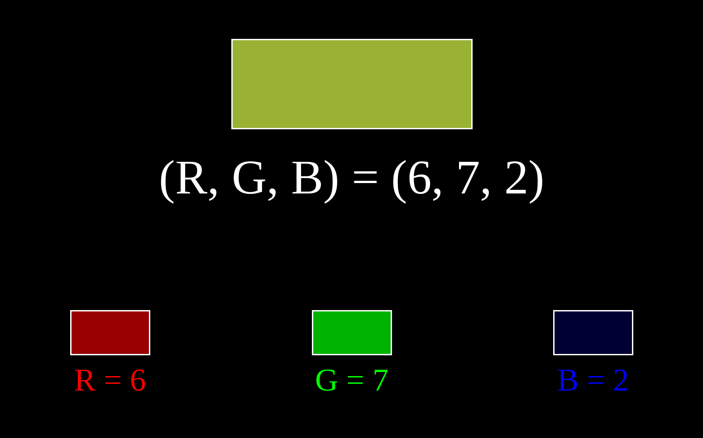
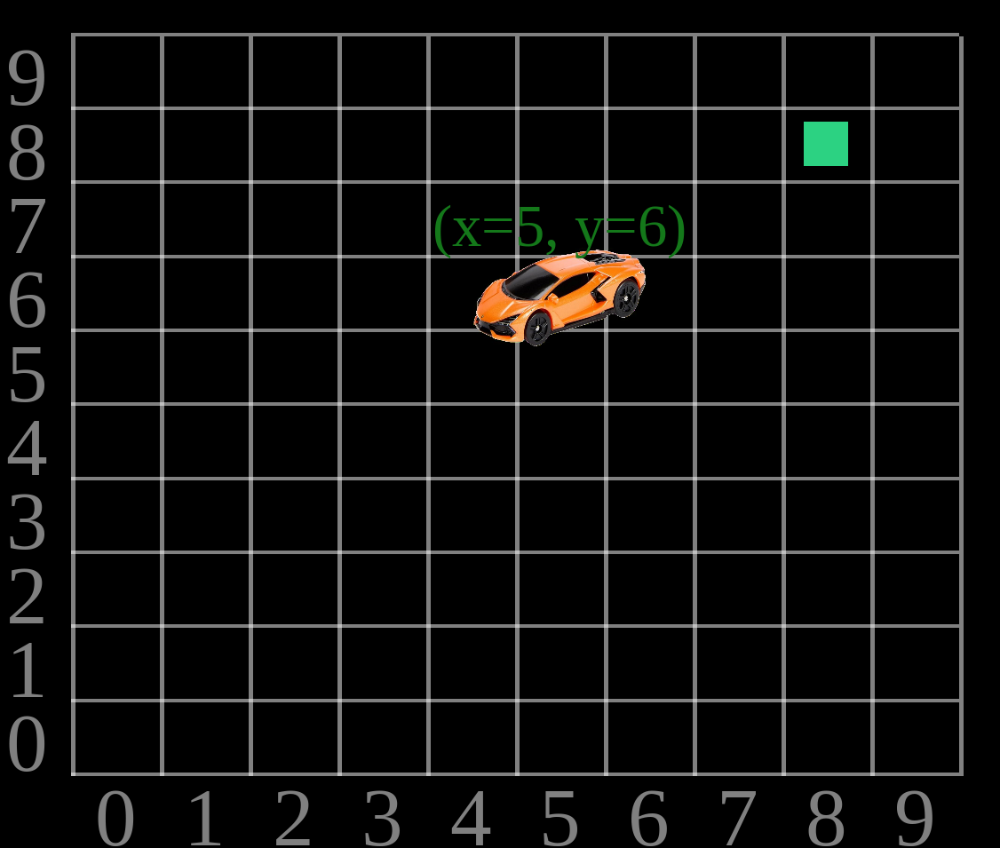
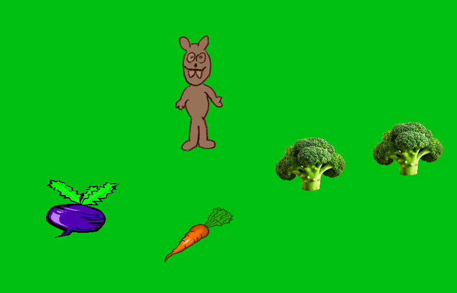
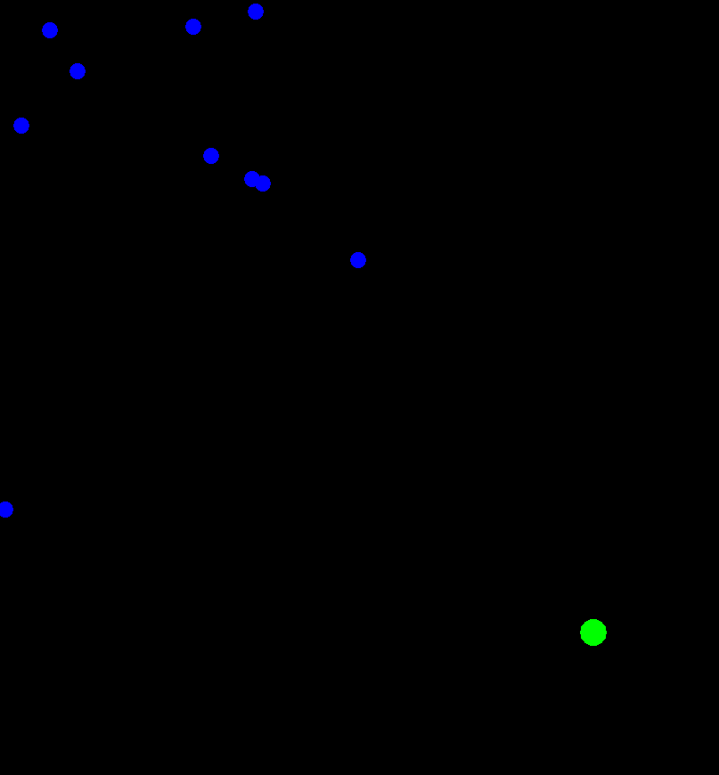
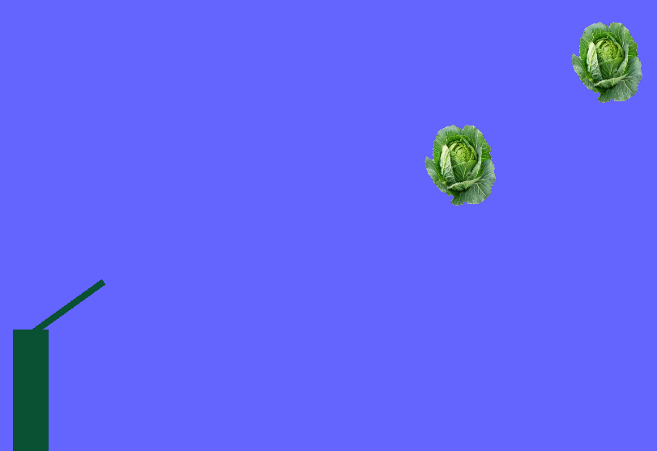
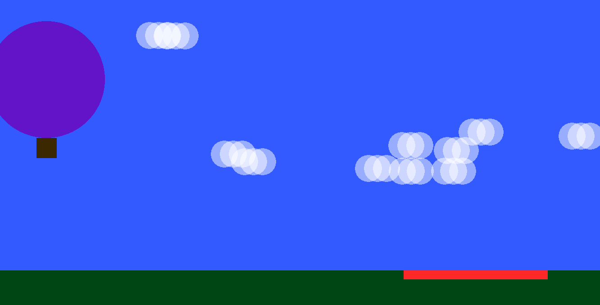
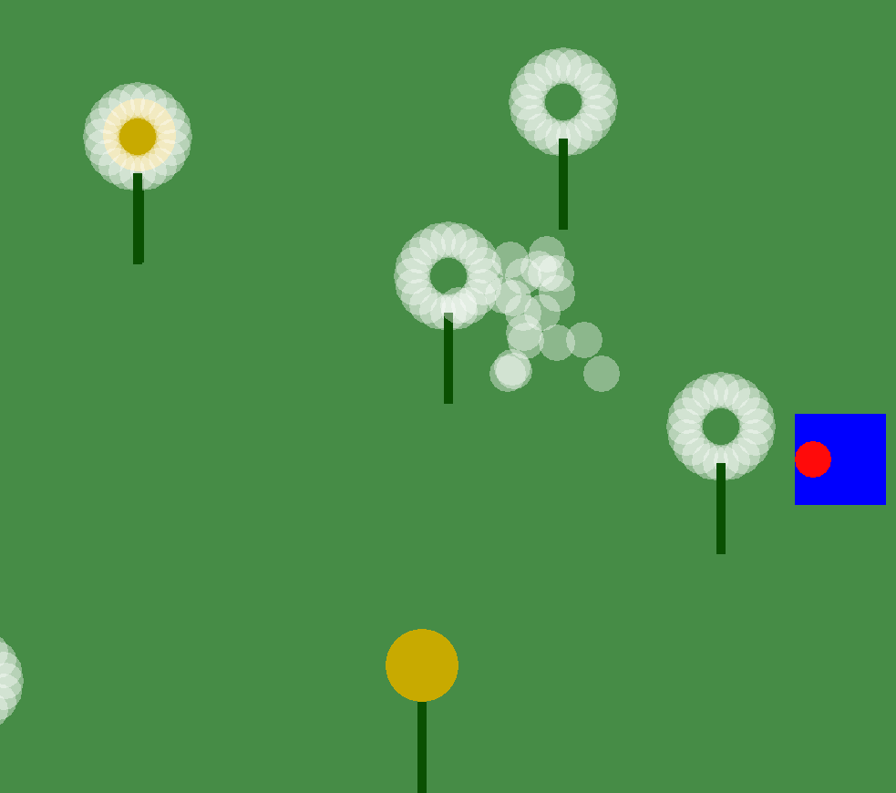
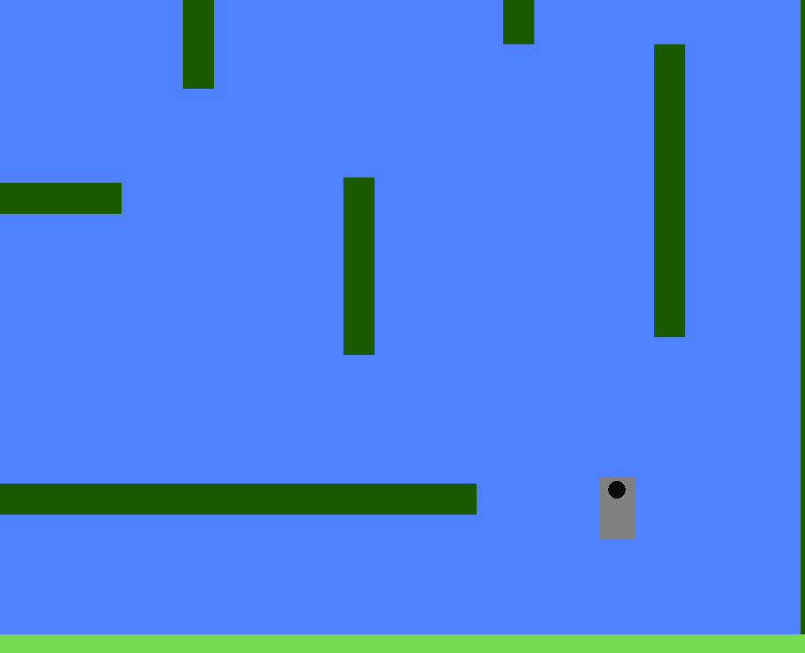
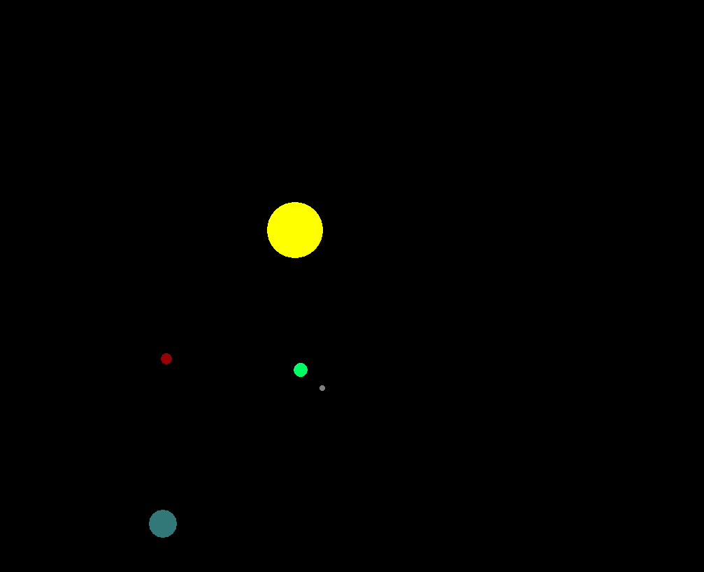

# Giochetti

Materiale didattico per un'introduzione al coding con Python e piccoli giochi da provare, modificare e anche dissezionare.

Per far partire un gioco, ad es:

```
uv run python cars.py
```

(aggiungere il parametro `f` alla fine per full-screen.)

Tutti i giochi si interrompono con Esc.

## (base)

(Utile prototipo per sviluppare nuovi giochini.)

## colors



Aumenta/diminuisci le componenti R, G, B e scopri il colore che ne risulta. Tasti: Q/A, W/S, E/D.

## cars



Sposta una macchinina nello schermo. Modifica i parametri del movimento per una maggiore verosimiglianza. Disponibile "cibo" da far mangiare alla macchinina. Tasti: Frecce, A, C (per mostrare la griglia in modalità movimento discreto).

## farmer



Muovi un contadino per lo schermo, fagli piantare alcune verdure. Tasti: Frecce, Q, W, E.

## fireworx



Fuochi d'artificio. Modifica i parametri di numero generazioni e numero frammenti. Sostituisci i pallini con immagini predefinite. Tasto: Spazio.

## bouncy


Palline nello schermo. Stadi successivi di realismo, dall'aggiunta di movimento, al rimbalzo, alla gravità, e infine dissipazione di energia. Tasto: Spazio (in modalità "mille palline").

## thrower



Cambia l'angolo di tiro e scopri la gittata. Tasti: Frecce, Spazio, Q.

## balloon



Fai atterrare la mongolfiera nell'area giusta, ma attento al vento! Tasti: Q, Z, I.

## dandelions



Gira per il prato e soffia sui soffioni maturi. Tasti: Frecce, Spazio.

## gravity



La dinamica del classico "platformer", con una sorpresa. Modalità classica, cambio gravità manuale, cambio casuale. Tasti: Sinistra/Destra/Alto, Z (per cambio manuale gravità).

## planets



Semplice simulazione di sistema solare. Sospendi e riavvia il moto dei pianeti con Spazio.
